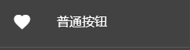
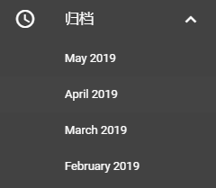
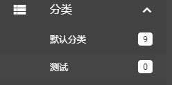
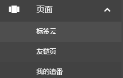
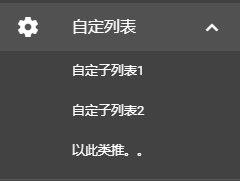
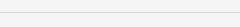
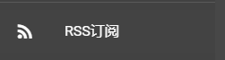
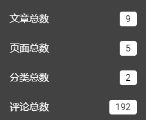

## 侧边抽屉
- 首页按钮为默认按钮不可删除。
- 图标请参考 https://www.mdui.org/docs/material_icon
- 全程请注意遵循 [JSON的语法](http://www.w3school.com.cn/json/json_syntax.asp) （否则语法不规范，报错两行泪

## 普通按钮

- `"name"` 按钮名称。
- `"link"` 按钮链接（如果链接为站外链接会自动添加 target="blank" 属性。
- `"icon"` 按钮图标（请前往 [MDUI Docs](https://www.mdui.org/docs/material_icon) 获取图标名。
- `"type"` 类型 `0` 为普通按钮。
```json
{
   "name":"普通按钮",
   "link":"#",
   "icon":"favorite",
   "type":"0"
}
```

## 归档按钮

- `"name"` 按钮名称，建议写为 `归档` 或 `时间归档`。
- `"link"` 按钮链接，归档不需要填写链接，请保持为空 `""` 或填写 `#`。
- `"icon"` 按钮图标，建议使用 `access_time` 这个图标。
- `"type"` 类型 `1` 为时间归档按钮（列表）。
```json
{
   "name":"归档",
   "link":"#",
   "icon":"access_time",
   "type":"1"
}
```

## 分类按钮

- `"name"` 按钮名称，建议写为 `分类` 。
- `"link"` 按钮链接，分类不需要填写链接，请保持为空 `""` 或填写 `#`。
- `"icon"` 按钮图标，建议使用 `view_list` 这个图标。
- `"type"` 类型 `2` 为分类按钮（列表）。
```json
{
   "name":"分类",
   "link":"#",
   "icon":"view_list",
   "type":"2"
}
```

## 页面按钮

- `"name"` 按钮名称，建议写为 `页面` 或 `独立页面` 。
- `"link"` 按钮链接，页面不需要填写链接，请保持为空 `""` 或填写 `#`。
- `"icon"` 按钮图标，建议使用 `view_carousel` 这个图标。
- `"type"` 类型 `3` 为独立页面按钮（列表）。
```json
{
   "name":"页面",
   "link":"#",
   "icon":"view_carousel",
   "type":"3"
}
```

## 列表按钮

- `"name"` 按钮名称。
- `"link"` 按钮链接，父级列表不需要填写链接，请保持为空 `""` 或填写 `#`。
- `"icon"` 按钮图标（请前往 [MDUI Docs](https://www.mdui.org/docs/material_icon) 获取图标名。
- `"type"` 类型 `4` 为自定义列表。
- `"list"` 子列表，写法参考如下Demo（注意遵循 [JSON的语法](http://www.w3school.com.cn/json/json_syntax.asp) ！
```json
{
   "name":"自定列表",
   "link":"#",
   "icon":"settings",
   "type":"4",
   "list": [{
    "name": "自定子列表1",
    "link": "http://domain.com/"
   },{
    "name": "自定子列表2",
    "link": "http://domain.com/"
   },{
    "name": "以此类推。。",
    "link": "http://domain.com/"
   }]
}
```

## 分割线

- `"type"` 类型 `5` 为分割线。
```json
{
   "type":"5"
}
```

## Rss订阅按钮

- `"type"` 类型 `6` 为RSS订阅按钮。
```json
{
   "type":"6"
}
```

## 数据统计

- `"type"` 类型 `7` 为数据统计。
- `"tes"` 数据统计具体类型 按照上图顺序及下面代码顺序依次为 `1` 文章总数 | `2` 页面总数 | `3` 分类总数 | `4` 评论总数
- 显示什么数据按需显示，不需要的删除即可，注意遵循 [JSON的语法](http://www.w3school.com.cn/json/json_syntax.asp)。 
```json
{
   "type":"7",
   "tes":"1"
},{
   "type":"7",
   "tes":"2"
},{
   "type":"7",
   "tes":"3"
},{
   "type":"7",
   "tes":"4"
}
```