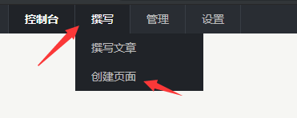
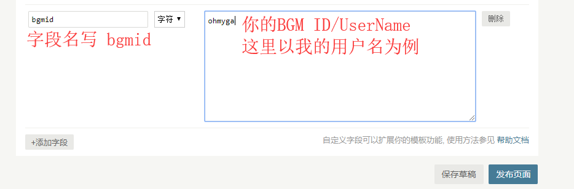

## 页面设置
- 首先新建一个独立页面。 

- 选择自定义模板 `追番页` （移动端看不清图片的话，长按图片在新窗口打开即可。 

- 拉到最下方 点击`添加字段` 添加一个字段名为 `bgmid` 的字段，内容为你的 [Bangumi](https://bgm.tv/) UID/UserName 。 

## 追番相关
- 前往 https://bgm.tv 注册一个账号。
- 搜索你在追的番剧，点击在看并保存为在看状态即可。 

- 如果自己手动添加过于麻烦，Chrome有拓展可以在你在Bilibili追番并同时在Bangumi订阅。