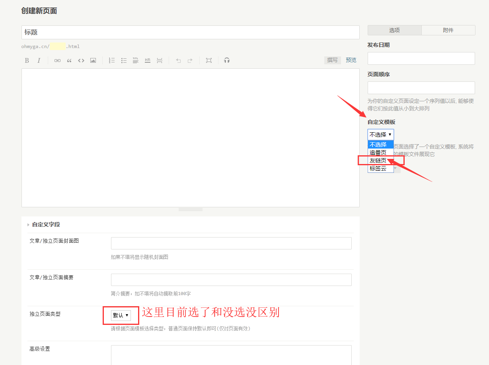
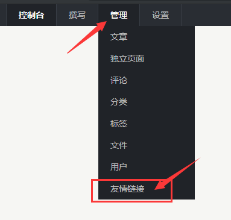
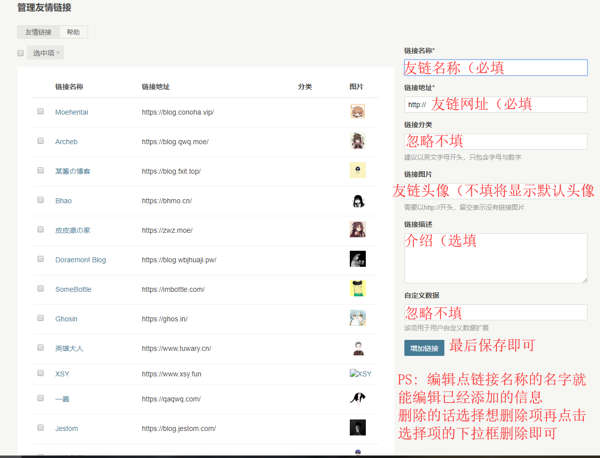

## 页面设置
- 首先新建一个独立页面。 

- 选择自定义模板 `友链页` （移动端看不清图片的话，长按图片在新窗口打开即可。 

- 最后保存即可。

## 插件配置
- 首先下载并安装 [links](http://www.imhan.com/archives/typecho_links_20141214/) 插件（否则页面将空白。
- 安装插件 将插件解压到 `/usr/plugins/` 确保文件夹名字为 `links` 避免报错。

- 友链管理页面在 `后台->管理->友情链接` 。 

- 添加友链，`链接名称`、`链接地址`为必填选项，`链接图片`为友链头像 不填将显示默认头像，`链接描述`为友链介绍 不填不显示，其余不用填（因为填了也没用。
- （移动端看不清图片的话，长按图片在新窗口打开即可。 
