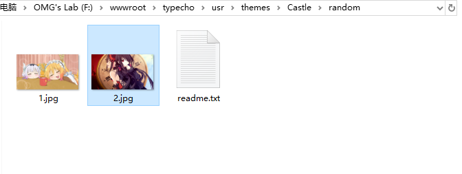

## 随机封面图源
- `本地` 为使用本地源。
- `api.ohmyga.cn` 为使用O's API的随机图源。
- `第三方CDN(附加随机参数)` 为使用自定义的随机图API 且将会在链接最后附加`?rand=`防止图片重复。
- `第三方CDN(不附加随机参数)` 为使用自定义的随机图API 但不附加任何随机参数，这可能导致整页封面都是同一张图。

## 本地图源
- 将格式为 `.jpg` 的图片放入 `/usr/themes/Castle/random/` 文件夹内。
- 图片名称随意，但不包括 `中文` `特殊符号` 等，否则将会报错导致。
- 不允许 `random` 文件夹内没有任何 JPEG/JPG 格式的图片，否则将会导致报错。

## 自定义API
- 选择 `第三方CDN(附加随机参数)` 或 `第三方CDN(不附加随机参数)` （根据API能否加参数选择，然后参考 [高级设置](advanced-setting) 。